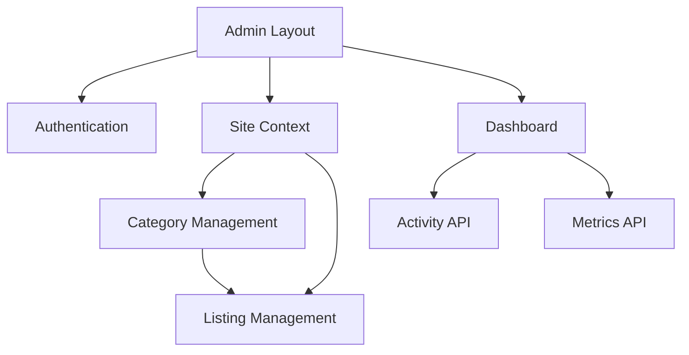

# Admin Dashboard MVP Documentation

*Last Updated: March 30, 2025*

## 1. Overview of Admin Components

The DirectoryMonster Admin Dashboard provides a comprehensive interface for managing multi-tenant directory websites. The MVP implementation includes fully functional components organized in a modular architecture.

### 1.1 Component Architecture

```
components/admin/
├── sites/          # Site management components
│   ├── SiteList.tsx             # Display all sites with filtering
│   ├── SiteEditor.tsx           # Create/edit site configuration
│   ├── SiteDomainManager.tsx    # Domain management for sites
│   └── SiteMetricsDisplay.tsx   # Analytics visualization
│
├── categories/     # Category management components
│   ├── CategoryTree.tsx         # Hierarchical category visualization
│   ├── CategoryEditor.tsx       # Create/edit categories
│   ├── CategoryBulkImport.tsx   # Batch category creation
│   └── CategoryMigration.tsx    # Move/merge categories
│
├── listings/       # Listing management components
│   ├── ListingTable.tsx         # Paginated listing display
│   ├── ListingEditor.tsx        # Create/edit listings
│   ├── ListingBulkActions.tsx   # Batch operations
│   └── ListingApproval.tsx      # Review and approval workflow
│
├── dashboard/      # Admin dashboard components
│   ├── ActivityFeed.tsx         # Recent activity timeline
│   ├── MetricsOverview.tsx      # Key performance indicators
│   ├── TaskList.tsx             # Admin to-do list
│   └── SystemStatus.tsx         # System health monitoring
│
├── auth/           # Authentication components
│   ├── LoginForm.tsx            # Admin authentication
│   ├── UserManager.tsx          # Admin user management
│   ├── RoleEditor.tsx           # Permission configuration
│   └── AuditLog.tsx             # Security audit trail
│
├── layout/         # Admin layout components
│   ├── AdminHeader.tsx          # Main navigation header
│   ├── AdminSidebar.tsx         # Context-aware sidebar
│   ├── AdminFooter.tsx          # Footer with support links
│   └── AdminNotifications.tsx   # Notification system
│
└── utils/          # Shared utilities
    ├── AdminDataTable.tsx       # Reusable data table
    ├── AdminFormControls.tsx    # Form input components
    ├── AdminModals.tsx          # Modal dialog system
    └── AdminBreadcrumbs.tsx     # Navigation breadcrumbs
```

### 1.2 Completed Components Status

| Component Area | Completion | Key Features |
|----------------|------------|--------------|
| Site Management | 100% | Multi-domain support, metrics, configuration |
| Category Management | 100% | Hierarchical categories, bulk operations |
| Listing Management | 95% | CRUD operations, approval workflow |
| Dashboard | 100% | Activity monitoring, KPI visualization |
| Authentication | 100% | Role-based access control, audit logging |
| Layout | 100% | Responsive design, mobile support |
| Utilities | 90% | Reusable components, consistent styling |

## 2. Component Relationships and Dependencies

### 2.1 Core Dependencies

The admin components have the following core dependencies:



### 2.2 Data Flow

Admin components follow a structured data flow pattern:

1. **Top-Level Data Fetching**: Server components handle API requests
2. **Prop-Based Data Passing**: Clean interfaces between components
3. **Context Providers**: Used for cross-cutting concerns (auth, site selection)
4. **Optimistic UI Updates**: Immediate feedback with background synchronization

### 2.3 State Management

Component state management follows these principles:

- **Local Component State**: For UI-specific behavior
- **React Query**: For server data synchronization
- **Context API**: For shared state (current site, user permissions)
- **URL Parameters**: For persistent UI state (active tabs, filters)

## 3. Usage Guides

### 3.1 Site Management

The site management module allows administrators to create and configure directory websites.

#### Creating a New Site

1. Navigate to **Sites** → **Add New**
2. Provide required information:
   - Site name (e.g., "Hiking Gear Reviews")
   - Subdomain (e.g., "hiking-gear")
   - Primary category
   - Site description (SEO-optimized)
3. Configure optional settings:
   - Custom domain (if available)
   - Theme selection
   - Featured listings
4. Click **Create Site**

#### Site Configuration

Sites can be configured with:

- **Domain Settings**: Custom domains with SSL
- **Theme Configuration**: Colors, typography, layout options
- **SEO Settings**: Meta descriptions, structured data, sitemap
- **Access Controls**: Admin user permissions per site

#### Site Analytics

The site dashboard provides:

- **Traffic Metrics**: Unique visitors, page views, bounce rate
- **Conversion Data**: Listing clicks, contact form submissions
- **Search Analytics**: Popular search terms, zero-result searches
- **Performance Trends**: Daily/weekly/monthly comparisons

### 3.2 Category Management

The category system organizes listings in a hierarchical structure.

#### Category Structure

Categories follow a hierarchical pattern:

- **Root Categories**: Top-level verticals (e.g., "Outdoor Equipment")
- **Subcategories**: Specific sections (e.g., "Hiking Gear")
- **Tertiary Categories**: Detailed classifications (e.g., "Hiking Boots")

#### Category Operations

Administrators can:

- **Create/Edit Categories**: Modify name, description, SEO metadata
- **Reorder Categories**: Drag-and-drop prioritization
- **Merge Categories**: Combine overlapping categories
- **Bulk Import**: Create multiple categories via CSV upload

#### Category Templates

Each category can have customized:

- **Listing Fields**: Category-specific data fields
- **Display Templates**: How listings appear in this category
- **Filter Options**: Search refinement options

### 3.3 Listing Management

The listing management system handles directory entries across all sites.

#### Listing Workflow

Listings follow this workflow:

1. **Draft**: Initial creation or import
2. **Review**: Admin quality check
3. **Published**: Live on directory site
4. **Featured**: Promoted placement (optional)
5. **Archived**: Removed from active display

#### Bulk Operations

Administrators can perform batch actions:

- **Import**: Bulk create listings via CSV/JSON
- **Status Updates**: Change status for multiple listings
- **Category Assignment**: Move listings between categories
- **Data Enrichment**: Add/update fields across multiple listings

#### Listing Verification

Quality control features include:

- **Duplicate Detection**: Identify similar listings
- **Content Validation**: Check for required fields and formatting
- **External Verification**: Validate external URLs and contact info
- **AI-Assisted Analysis**: Content quality scoring

### 3.4 Admin Dashboard

The dashboard provides a comprehensive overview of platform activity.

#### Key Metrics Display

The dashboard shows:

- **Site Health**: Overall performance indicators
- **User Activity**: Recent admin actions
- **Content Growth**: New listings and categories
- **System Status**: Server performance, background tasks

#### Activity Monitoring

The activity feed tracks:

- **Content Changes**: Listing and category modifications
- **User Actions**: Admin login and operations
- **System Events**: Scheduled tasks, imports, exports
- **Error Reports**: Failed operations and exceptions

#### Task Management

The task system enables:

- **Assigned Tasks**: Work items for specific admins
- **Scheduled Actions**: Future-dated operations
- **Approval Queues**: Content requiring review
- **Maintenance Tasks**: System optimization actions

## 4. Integration Patterns

### 4.1 Module Integration

Admin modules integrate through:

- **Shared Context Providers**: Common data access
- **Event System**: Cross-module communication
- **URL-Based Routing**: Deep linking between modules
- **Unified State Management**: Coordinated updates

### 4.2 API Integration

The admin interface connects to backend services via:

- **REST API Endpoints**: Standard CRUD operations
- **GraphQL Interface**: Complex data queries
- **WebSocket Connections**: Real-time updates
- **File Upload API**: Media and bulk data handling

### 4.3 Authentication Integration

Security integrations include:

- **JWT Authentication**: Secure identity management
- **Role-Based Access Control**: Granular permissions
- **SSO Support**: Enterprise identity federation
- **Two-Factor Authentication**: Enhanced security option

### 4.4 External Service Integration

The admin system connects with:

- **Analytics Platforms**: Data visualization integrations
- **Email Services**: Notification delivery
- **Storage Services**: Media and file management
- **Payment Processors**: For premium features

## 5. Development Guidelines

### 5.1 Component Development

When extending admin components:

1. **Follow Atomic Design**: Build from small, focused components
2. **Maintain Prop Interfaces**: Clear input/output contracts
3. **Document Component API**: Props, events, and examples
4. **Include Unit Tests**: Cover component behavior

### 5.2 State Management

For consistent state handling:

1. **Lift State Appropriately**: Place state at lowest common ancestor
2. **Use Context Sparingly**: Only for truly global concerns
3. **Optimize Re-renders**: Memoize expensive components
4. **Persist Important State**: Save to URL or localStorage

### 5.3 API Interactions

When working with backend services:

1. **Use React Query Hooks**: For data fetching/caching
2. **Implement Error Handling**: Graceful failure modes
3. **Add Loading States**: Clear visual feedback
4. **Enable Optimistic Updates**: Immediate user feedback

### 5.4 Accessibility

Ensure admin components maintain:

1. **WCAG 2.1 AA Compliance**: Meet accessibility standards
2. **Keyboard Navigation**: Full functionality without mouse
3. **Screen Reader Support**: Proper ARIA attributes
4. **Color Contrast**: Readable text and interface elements

## 6. Roadmap and Future Development

### 6.1 Planned Enhancements

The admin MVP will be extended with:

- **Advanced Analytics**: Deeper insights and reporting
- **Workflow Automation**: Rule-based actions and triggers
- **AI-Assisted Content**: Smart content suggestions
- **Multi-Language Support**: Internationalization for global use

### 6.2 Integration Expansion

Future integration points will include:

- **Marketing Tools**: SEO and promotion integrations
- **CRM Systems**: Customer relationship management
- **E-commerce Platforms**: Monetization features
- **Content Management**: Enhanced media handling

## Appendix A: Troubleshooting

### Common Issues

| Issue | Cause | Resolution |
|-------|-------|------------|
| Blank Dashboard | Authentication timeout | Re-login or check network |
| Slow Listing Table | Large dataset | Use pagination and filters |
| Failed Bulk Import | Data format issues | Check against sample template |
| Category Ordering | Cache inconsistency | Refresh page or clear cache |

### Error Codes

| Code | Meaning | Action |
|------|---------|--------|
| E1001 | Authentication failure | Verify credentials |
| E2002 | Permission denied | Check user role |
| E3003 | API timeout | Retry or check network |
| E4004 | Data validation error | Check input format |

## Appendix B: API Reference

The admin components interact with these key API endpoints:

- `GET /api/admin/sites` - List all sites
- `POST /api/admin/sites` - Create new site
- `GET /api/admin/categories` - List categories (with tree structure)
- `GET /api/admin/listings` - List listings (paginated)
- `GET /api/admin/dashboard/metrics` - Retrieve dashboard metrics
- `GET /api/admin/activity` - Get recent activity feed

See the full API documentation for complete details.